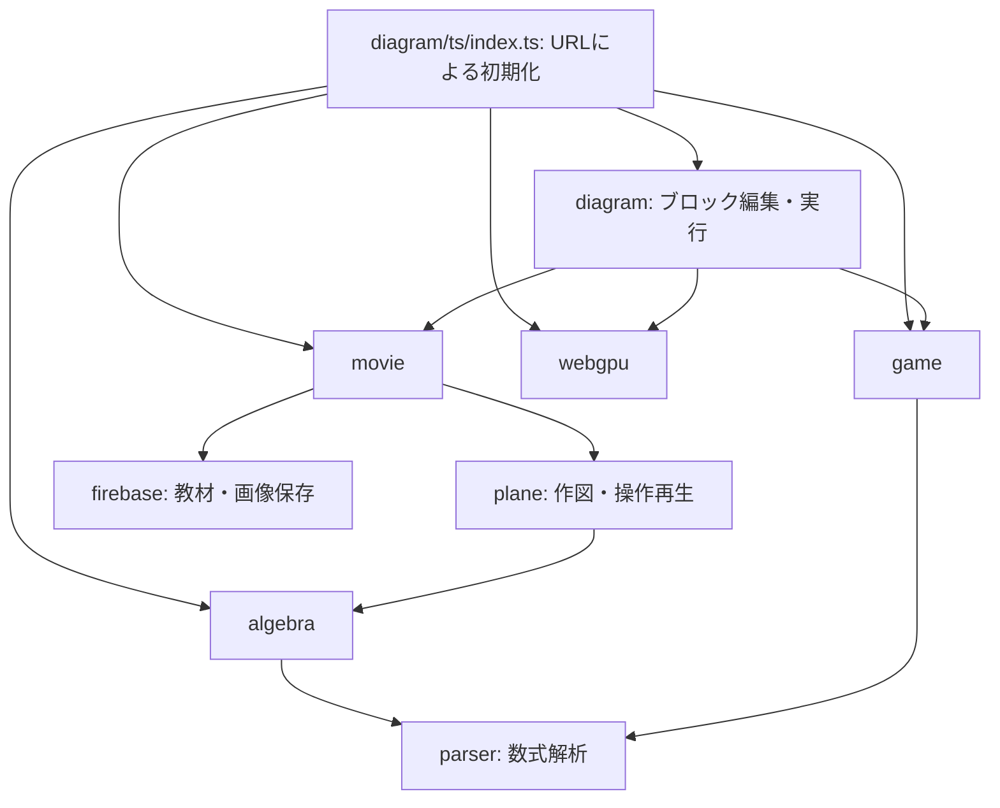

# uroaの構成と機能

調査日: 2026-10-09（日本時間）。主要ソース、設定、既存文書を読んだ静的な調査結果。全行の監査や実行検証ではなく、未コミット変更を含むローカル状態を対象とする。2026-10-09の調査では、アプリ起動、ビルド、テスト、外部API呼び出し、Firebase操作、実機操作は行っていない。後日の実行確認は [current-state.md](current-state.md) に条件と結果を記録する。

## 目的と全体構成

uroaは数学・科学教材を作成／再生するWebアプリ群。TypeScriptを中心に、KaTeXによる数式表示、Canvasによる図形・ゲーム描画、ブラウザー音声合成、Firebaseによる保存、WebGPUによる計算・描画を組み合わせる。

[.gitmodules](../.gitmodules)には12個のGitサブモジュールが定義される。algebraは2026-10-11に通常フォルダーへ移行し、旧履歴も統合した（[移行記録](algebra-monorepo.md)）。[package.json](../package.json)のnpm workspaces登録は9個で、サブモジュールと同じ一覧ではない。[tsconfig.sys.json](../tsconfig.sys.json)と [tsc-all.bat](../tsc-all.bat)は13個のTypeScriptプロジェクトを参照する。

実装の中心は各モジュールの `ts/`。ルートの `public/` には各画面のHTML、翻訳辞書、教材・ゲーム・ブロック図のデータがある。WebGPU実行資産は `webgpu/public/` にあり、ルートVite設定でコピーされる。

## アプリの入口と連携

[index.html](../index.html)は `diagram/ts/index.ts` を読み込み、各アプリへのリンクを置く。[diagram/ts/index.ts](../diagram/ts/index.ts)は `DOMContentLoaded` 時にURLパスで初期化先を選ぶ。

| パスの先頭 | 初期化 |
|---|---|
| `/algebra` | `initAlgebra()` |
| `/webgpu` | `initWebGPU()` |
| `/game` | `initGame()` |
| `/diagram` | `initDiagram()`の後、game・webgpu・movieも初期化 |
| `/movie` | `initMovie()` |
| その他 | `no project`を出力。ルート画面は各アプリへの入口 |

この入口が13モジュールすべてを直接起動するわけではない。共通ライブラリーは各アプリが利用し、lessonなどには個別の入口がある。

`diagram/ts/procedure.ts`の `PlayGameBlock` は `playGameWorld()`、`PlayMovieBlock` は `playAllGraph()`、`PlayWebGPUBlock` は `playWebGPUPackage()`を呼ぶ。`diagram_util.ts`の `switchActiveModule()`が画面レイヤーを切り替える。



図は主要な呼び出し・依存関係の抜粋。i18nなどの共通依存や全インポートは省略する。

## モジュール一覧

| フォルダー | 機能 | 主要ソース |
|---|---|---|
| `parser` | 数式の字句・構文解析、変数・有理数・演算・関数・束縛の木構造、LaTeX表示 | [parser.ts](../parser/ts/parser.ts)、[lex.ts](../parser/ts/lex.ts)、[tex.ts](../parser/ts/tex.ts) |
| `algebra` | 移項、代入、方程式の加算・除算、同類項整理、約分、定理照合、証明手順、数式の部分選択・書き換え | [algebra.ts](../algebra/ts/algebra.ts)、[simplifier.ts](../algebra/ts/simplifier.ts)、[formula_matcher.ts](../algebra/ts/formula_matcher.ts)、[ProofStep.ts](../algebra/ts/ProofStep.ts) |
| `plane` | 点・直線・円・楕円・円弧・多角形の作図、等長・等角・平行・垂直の制約、合同・相似などの関係管理、操作記録・再生 | [shape.ts](../plane/ts/shape.ts)、[tool.ts](../plane/ts/tool.ts)、[constraint.ts](../plane/ts/constraint.ts)、[deduction/](../plane/ts/deduction/) |
| `diagram` | ブロック接続による入力・計算・比較、条件分岐、繰り返し、待機、読み上げ、他アプリ実行、実機向けHTTP指令 | [index.ts](../diagram/ts/index.ts)、[block.ts](../diagram/ts/block.ts)、[procedure.ts](../diagram/ts/procedure.ts)、[port.ts](../diagram/ts/port.ts) |
| `game` | JSONによるCanvas教材構築、順次／並列動作、算数問題の生成・採点、筆算、効果音・正解演出、等角投影マップ | [index.ts](../game/ts/index.ts)、[registry.ts](../game/ts/registry.ts)、[lesson/exercise.ts](../game/ts/lesson/exercise.ts)、[action/sequencer.ts](../game/ts/action/sequencer.ts) |
| `movie` | 作図操作・数式・読み上げを組み合わせる教材アニメーション、連続再生、スライド・クイズ編集と再生、バックアップ | [index.ts](../movie/ts/index.ts)、[flow.ts](../movie/ts/flow.ts)、[lesson.ts](../movie/ts/lesson.ts)、[timeline.ts](../movie/ts/timeline.ts) |
| `webgpu` | GPU計算と3D描画、データで定義する実行グラフ、物理シミュレーション、カメラ・パラメーター操作、画像保存 | [control.ts](../webgpu/ts/control.ts)、[main.ts](../webgpu/ts/main.ts)、[primitive.ts](../webgpu/ts/primitive.ts) |
| `firebase` | メール／パスワード認証、Firestoreの教材・フォルダー管理、教材間の関連図、画像・サムネイルのStorage保存 | [firebase.ts](../firebase/ts/firebase.ts)、[contents.ts](../firebase/ts/contents.ts)、[storage.ts](../firebase/ts/storage.ts)、[graph/](../firebase/ts/graph/) |
| `i18n` | 12言語の翻訳辞書、表示言語・音声言語、ブラウザー音声合成、読み上げ進行に応じた強調、ベクトル・UI共通処理 | [reading.ts](../i18n/ts/reading.ts)、[speech.ts](../i18n/ts/speech.ts)、[vector.ts](../i18n/ts/vector.ts)、[ui.ts](../i18n/ts/ui.ts) |
| `layout` | ボタン、入力、画像、ダイアログ、LaTeX表示などのHTML部品とGrid／Flex配置 | [main.ts](../layout/ts/main.ts)、[misc.ts](../layout/ts/misc.ts) |
| `lesson` | 独自教材テキストから見出し・本文・定義・定理・数式をHTMLへ変換 | [lesson.ts](../lesson/ts/lesson.ts) |
| `media` | マイク録音、録音の再生・ダウンロード | [media.ts](../media/ts/media.ts) |
| `plot` | README・設定ファイルはあるが、調査時点では実装ソースがない | [README.md](../plot/README.md)、[package.json](../plot/package.json) |

### 数学・図形処理の主要な境界

parserの `parseMath()` は `Term`、`App`、`RefVar`、`ConstNum`、`Rational`、`Binding`などの数式表現を作り、algebra、plane、game、lessonなどの基盤となる。

algebraでは [formula.ts](../algebra/ts/formula.ts)、[proof.ts](../algebra/ts/proof.ts)が定理・証明モデル、[math_file_parser.ts](../algebra/ts/math_file_parser.ts)が独自 `.math` ファイル、[manipulation.ts](../algebra/ts/manipulation.ts)が書き換え・簡約の操作を担当する。[tex.ts](../algebra/ts/tex.ts)は数式の部分選択と木構造・表示の対応を管理する。[galois.ts](../algebra/ts/galois.ts)には互除法や置換・群に関する実験コードがある。

planeでは [geometry.ts](../plane/ts/geometry.ts)、[matrix.ts](../plane/ts/matrix.ts)が幾何計算、[factories.ts](../plane/ts/factories.ts)がツール・命題などの生成、[inference.ts](../plane/ts/inference.ts)と [all_functions.ts](../plane/ts/all_functions.ts)が状態・関係・サービス接続を担う。[operation.ts](../plane/ts/operation.ts)、[play.ts](../plane/ts/play.ts)、[json.ts](../plane/ts/json.ts)は操作記録・再生・保存復元、[plane_ui.ts](../plane/ts/plane_ui.ts)と [view.ts](../plane/ts/view.ts)は画面を担当する。

これらに証明や幾何の関係管理コードはあるが、任意の定理・問題を自動的に解く完全な証明器という保証は今回確認していない。

### diagramの実機向け処理

[canvas.ts](../diagram/ts/canvas.ts)と [ui.ts](../diagram/ts/ui.ts)が編集・描画、[port.ts](../diagram/ts/port.ts)が接続・値の伝播、[json-util.ts](../diagram/ts/json-util.ts)がJSON保存を担当する。入力・計算ブロックと手続きブロックを接続し、Start／Stopで実行する。

サーボ、カメラ、顔検出結果、超音波距離センサー向けのブロックがある。ただし、ブラウザー内で顔検出やセンサー取得を完結する構成ではない。[diagram_util.ts](../diagram/ts/diagram_util.ts)の `sendData()` は同一オリジンの `POST /send_data` にJSONを送る。

- サーボ: `{command: "servo", channel, value}`。
- 状態取得: `{command: "status"}`。応答キューから画像ファイル名、顔領域、距離を取り込む想定。
- 現在は `diy_sbc = false` によりキュー初期化・センサーの定期取得が無効。サーボ送信コードは別に残っている。

### game・movieのデータと実行

gameのデータは `public/game/data/` にある。`initGame()`が開発／本番設定を読み、初期画面の等角投影マップを構築する。`loadWorld()`が指定ステージを読んでUIを作り、`playGameWorld()`がシーケンサーを起動する。

[widget/](../game/ts/widget/)にCanvas、文字、画像、入力、Grid、スクロール、メニュー、ツリーなどがあり、[math/](../game/ts/math/)に桁・画像による数の表示、筆算、方程式・証明UIがある。[lesson/sound.ts](../game/ts/lesson/sound.ts)と [lesson/confetti.ts](../game/ts/lesson/confetti.ts)は効果音・演出、[isometric/isometric.ts](../game/ts/isometric/isometric.ts)はマップ・ステージ選択を担当する。

movieはplaneの作図操作を音声・数式表示と組み合わせる。`flow.ts`は教材取得・連続再生・変換・バックアップ、`lesson.ts`はスライド・クイズ、`movie_ui.ts`は再生／編集画面と言語選択を担当する。保存にはfirebase、翻訳・読み上げにはi18n、HTML部品にはlayoutを使う。独立モジュールのlessonと、movie内のスライド・クイズ機能は別物。

Firebase接続設定はソースにあるが、本番のデータ・権限・アクセスルールは今回確認していない。ローカルのルール見本を本番で有効なルールとは扱わない。

## WebGPUの構成

### 実行資産とエンジン

シミュレーション実行資産は同名の3ファイルを基本とする。

| ファイル | 役割 |
|---|---|
| `<id>.json` | metadata、GPU資源、Compute／Renderノード、バインディング、UIの定義 |
| `<id>.wgsl` | GPUの計算・描画コード。`// @shader:`で複数シェーダーを分割 |
| `<id>.js` | ノード呼び出し、繰り返し、`swapPingPong()`、`yield`を記述する独自DSL |

DSLはJavaScript風の構文だが、通常のJavaScriptファイルとして実行しない。`GraphManager.parseSchemaScript()`が独自の字句・構文解析を行い、ジェネレーターで実行順序を制御する。`.js`という拡張子だけを根拠に、任意のJavaScriptをブラウザーで実行する方式へ変更しない。

| ソース | 役割 |
|---|---|
| [index.ts](../webgpu/ts/index.ts) | URLのschema選択、従来デモ・パッケージ起動 |
| [main.ts](../webgpu/ts/main.ts) | デバイス・Canvas・カメラ・メッシュ準備、毎フレーム更新、画像保存 |
| [control.ts](../webgpu/ts/control.ts) | GPU資源・パイプライン・バインディング、Uniform転送、実行グラフ、読み戻し |
| [schema_validator.ts](../webgpu/ts/schema_validator.ts) | JSON定義と参照の検証・問題表示 |
| [sim_ui.ts](../webgpu/ts/sim_ui.ts) | 定義からスライダー・選択欄・ボタンを生成 |
| [primitive.ts](../webgpu/ts/primitive.ts)、[camera.ts](../webgpu/ts/camera.ts) | メッシュ、描画パイプライン、カメラ操作 |
| [lex.ts](../webgpu/ts/lex.ts)、[parser.ts](../webgpu/ts/parser.ts)、[syntax.ts](../webgpu/ts/syntax.ts) | 独自言語・シェーダー関連の解析と構文表現 |
| [builder/](../webgpu/ts/builder/) | TypeScriptの定義作成API、DSL構築、シリアライズ |
| [build/cli.ts](../webgpu/build/cli.ts) | 定義ソースからJSON・DSLを生成、既存資産との比較 |

CLIが生成するのはJSONとDSLであり、WGSLの計算コードは別ソースとして管理される。

### 14種類の物理エンジン

一覧は [schema_public_path.ts](../webgpu/ts/schema_public_path.ts)、作成用ソースは [build/sims/](../webgpu/build/sims/)、実行資産は [public/engines/physics/](../webgpu/public/engines/physics/) にある。

| ID | 主な対象 |
|---|---|
| `ball` | 球の運動 |
| `collision` | 球同士の衝突 |
| `surface` | 時間変化する曲面・法線・描画 |
| `vector_field` | 矢印によるベクトル場表示 |
| `life` | Conwayのライフゲーム |
| `ising` | 2次元Isingモデル |
| `md` | Lennard-Jones分子動力学 |
| `bec` | 2次元Gross–Pitaevskii方程式による平均場BEC |
| `hydrogen_orbital` | 水素原子軌道のボリューム描画 |
| `cfd_simple` | 簡易流体・染料移流 |
| `thermal_fem` | 規則格子上の熱拡散 |
| `em_fem` | 静電場のPoisson方程式を用いる計算・表示 |
| `fem_cg` | 共役勾配法による変形計算 |
| `fem_cg2` | 共役勾配法による弾性計算 |

`?schema=<id>`で起動する経路と、`?schema=all`で順にデモを行う経路がある。これら以外にも `package/test.json`、`ts/lgt/`などを使い、電磁波、電子雲、Hopfファイバー束、Liouville、ハミルトンベクトル場、三体問題、U(1)／SU(2)／SU(3)格子ゲージ、Higgs、HMC、フェルミオン、CG・Dirac CGなどのデモを起動する。

名称は実装対象を示し、数値モデルの物理的妥当性を今回検証したものではない。BECのtemperatureはコメント上、相互作用を調整する教材用パラメーターで、実際の有限温度モデルとは区別される。

## ビルドと配信

| ファイル | 役割 |
|---|---|
| [tsconfig.sys.json](../tsconfig.sys.json)、[tsc-all.bat](../tsc-all.bat) | TypeScript一括ビルド |
| [vite.config.ts](../vite.config.ts) | 共通入口、モジュール別名、WebGPU資産コピー、5アプリの公開用HTML生成 |
| [vite.config.base.ts](../vite.config.base.ts) | 共通Vite設定の補助ファイル |
| [build_all.py](../build_all.py) | TypeScriptビルド呼び出し、条件付き子プロジェクトViteビルド、親distへの成果物・公開資産同期 |
| [web.py](../web.py) | Flaskでdistを配信。ポート5000 |
| [firebase.json](../firebase.json) | Firebase Hostingの公開先をdistに設定 |
| [movie/python/make_audio.py](../movie/python/make_audio.py) | Azure Speechによる教材音声生成 |
| [movie/python/timeline.py](../movie/python/timeline.py) | 音声長集計、音声結合、字幕生成などの補助処理 |

Vite開発サーバーの `POST /api/save` は数式関連のテキスト／JSONを `public/algebra/output/` に保存する。この開発用ミドルウェアが、静的HostingやFlask配信にも存在するとは扱わない。

以下は2026-10-09の静的調査で整理したコマンド例。後日の実行結果はcurrent-state.mdへ記録する。依存関係、plotの未実装、外部資産などを含む一括ビルドの成功は未確認。

```powershell
# 作業ディレクトリ: uroa
npm run build:all
npx vite build
python build_all.py
python web.py
```

WebGPU定義CLIは出力・比較先を現在のディレクトリ基準で解決する。次の例は **uroa/webgpu** で実行し、tsxが利用できる環境を前提とする。

```powershell
# 作業ディレクトリ: uroa/webgpu
npx tsx build/cli.ts build/sims/ball.ts --check
npx tsx build/cli.ts build/sims/fem_cg.ts --check
```

`--check`はJSON内容比較とDSL文字列／トークン比較を行う。比較先が存在しない場合はスキップするため、成功終了だけで資産の存在やGPU動作を保証しない。

## 未実装・無効化・調査上の制限

| 対象 | 確認した状態 |
|---|---|
| diagramのセンサー取得 | `diy_sbc = false`によりキュー初期化・定期取得は無効。サーボ送信は別に残る。 |
| `POST /send_data` | 呼び出し側はあるが、調査した現行ソースに対応サーバー実装が見つからない。web.pyは静的配信、Viteには別の `/api/save` がある。 |
| mediaのCanvas録画・音声合成 | コメントブロック内で実行されない。 |
| lessonの `@let` | `readLet()`が例外を投げる未実装。 |
| plot | 機能を実装したソースがない。 |
| 実行検証 | 今回は未実施。ソースにあることと動作確認済みであることを区別する。 |

`webgpu/framework.md`や `NEXT_TASKS.md`は参考資料だが、未完了リストが現行実装と一致するとは限らない。実際にはbuild/simsに14種類の定義がある。再開時は現行ソースを確認する。

`tmp/zip/`にはサブプロジェクトの過去の展開コピーがある。`tmp/hmc.py`はNumPyによる回帰モデルのHMC実験、`tmp/icon.py`はPNGからICOを生成する補助スクリプトで、統合アプリの入口から呼ぶ構成ではない。

## robotとの関係とフィジカルAI教材

隣接する [robotの設計文書](../../robot/docs/architecture.md) に、AI質問画面、BLEサーボ・IMU操作、DCモーター復旧確認を記録している。

| 機能 | 現在の方式 |
|---|---|
| uroa/diagramの実機ブロック | HTTP `POST /send_data` |
| robot/esp32-ble-lab | Web Bluetoothと独自バイナリプロトコル |
| robot/chat | HTTP `POST /api/ask`経由のGemini応答 |

これらを直接結び付けるコードは今回確認した現行ソースにはない。サーボ用ブロックが存在することと、ESP32への接続が実装済みであることを区別する。

ユーザーはESP32とAndroidタブレット／携帯を組み合わせたフィジカルAI教材を検討している。ブラウザーのChatGPTでの相談仕様の詳細は未共有。学習目標、対象、機器、通信方式、AIと制御の役割を決定済みとして推測しない。

## 更新方法

役割、依存関係、入口、通信・データ形式、実装範囲が変わったら該当節を更新する。実行検証を追加する際は日付・対象・条件・結果を記録し、今回の静的調査や既存文書と区別する。詳細な設計判断は専用記録へ分け、AGENTS.mdは短く保つ。

## 議論で共有された経緯と改善案

2026-10-10追記。ユーザーによると、planeのall_functions.tsはnamespaceからモジュールへの移行時に循環参照を回避するため作られた。分割を検討するときは、既存のimport type、AppServices、生成関数登録による依存の整理を維持する。

ユーザーはrobotの全機能をuroaへ組み込む方針を示した。単一リポジトリ化、5アプリの回帰テスト、アニメーションの手動進行・状態取得、共通入口と責任分担の整理を含む作業案は [improvement-plan.md](improvement-plan.md) に記録する。これは改善の提案であり、Git統合や実機連携が完了したことを示さない。

## 2026-10-10: 機能索引と実行確認

[features.md](features.md)に59項目の目的・入口・関連ソース・資産・実装範囲を整理した。[current-state.md](current-state.md)にGit状態、入力資産の識別、型確認、Viteビルド、5画面の起動・代表操作、未確認項目を記録した。

開発環境の5画面表示と一部操作を確認した一方、型確認には7件の診断がある。ルートViteビルドは成功するが、previewではalgebraの保存API要求が404、残る4画面のTS入口も404となった。旧diagramサンプルのTTSテキストが再保存で失われることも確認した。別経路のbuild_all.pyはPython環境の問題で未実行。全機能、外部サービス、Android、実機の確認済みを意味しない。

## 2026-10-10: 公開用入口・保存API依存・型診断の修正

buildAppPagesPluginがalgebra・game・diagram・movie・webgpuのHTMLへ共通入口の生成済みJavaScript/CSS参照を組み込む。ソースHTMLのTypeScript参照は維持し、WebGPUのindex.htmlはビルド時の静的コピーから除外して生成結果の上書きを防ぐ。開発時は従来通りコピー対象として配信する。

testProofはexample.mathの読込・解析を行い、開発用出力はsaveProofOutputへ分けた。initAlgebraはViteのDEV条件でのみ保存を実行し、保存失敗は警告にして後続の簡約を継続する。読込・解析の失敗はこのcatchの対象外。

KaTeX内部の未使用importを削除し、makeUIFromJSONへButton/Labelの型オーバーロードを追加した。クラス参照はimport typeとし、実行時の生成関数登録は維持した。全体の型確認、ルートViteビルド、開発・ビルド後の5画面起動、保存APIの成功・失敗・非呼出しを確認した。音声終了を模擬した完了確認と通常音声の確認は区別する。条件と残件は [current-state.md](current-state.md) の修正後の記録を参照する。
